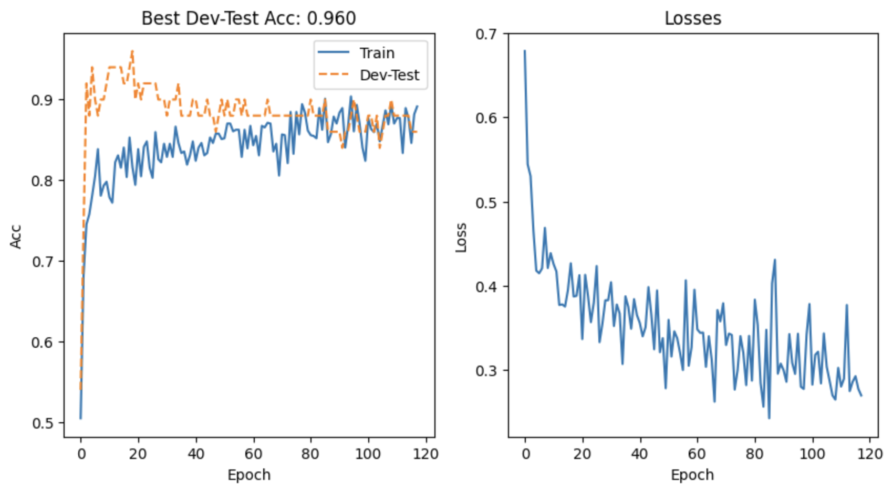

# 🫀 Neural Heart Disease Classifier

A PyTorch-based neural network model for predicting heart disease presence from clinical patient data.  
This project demonstrates a full ML workflow — from data preprocessing and feature scaling to model design, K-Fold cross-validation, and ROC-AUC evaluation.

---

## 📊 1. Data Preprocessing

- Missing values were handled using **median imputation**:  
  `X = X.fillna(X.median(numeric_only=True))`

- Outliers in `chol` (cholesterol) were capped below 500 to remove extreme anomalies.

- The dataset initially contained **5 heart disease classes (0–4)**:

  

- Because the dataset was **highly unbalanced**, all disease levels > 0 were merged into a single class (`1`) to create a **binary classification problem**:  
  `y = (y > 0).astype(int)`

  

- Features were **standardized** using `StandardScaler()` for consistent feature scaling.

- The dataset was split into **train/dev/test** subsets with stratified sampling to maintain label proportions.

- To assess generalization, **K-Fold Cross-Validation** was used with **K = 6**, ensuring every sample participated in both training and validation.

---

## 🧠 2. Model Architecture

A fully-connected **feedforward neural network** built with **PyTorch**, designed for binary classification.

**Layers:**
- Input layer: `13 → 16`
- Hidden layers: `16 → 32 → 64`
- Output layer: `64 → 1`

**Regularization & normalization:**
- Batch Normalization after each hidden layer for stable learning.
- Dropout (`p = 0.3`) to reduce overfitting.
- Activation: **ReLU**

**Optimization:**
- Loss: `BCEWithLogitsLoss`
- Optimizer: `Adam (lr = 0.005, weight_decay = 1e-4)`
- Learning rate scheduler:  
  `ReduceLROnPlateau(mode='min', factor=0.9, patience=10)` — lowers LR when loss stops improving.

---

## ⚙️ 3. Training Strategy

- **Early stopping**: patience = 100 epochs to prevent overtraining.
- Scheduler steps based on **training loss** each epoch.
- Model automatically restores the **best state** (highest validation accuracy) after training.
- Performance tracked per epoch: loss, training accuracy, validation accuracy.

A sample single-run training curve is shown below:

---

## 🔁 4. K-Fold Cross-Validation

To ensure model robustness, **6-fold cross-validation** was performed.  
Each fold trained on 5/6 of the data and validated on the remaining 1/6.

**Results:**
- Average validation accuracy: **≈ 86.25%**
- Fold accuracies ranged from **70% to 100%**
- Training and validation curves showed **consistent convergence** with low overfitting

This confirms that the model generalizes well across unseen subsets of data.

---

## 🧪 5. Final Evaluation

After cross-validation, the **best-performing model** was selected and tested on the held-out test set.

**Results:**
- Final test accuracy: **≈ 78.7%**
- ROC-AUC: **0.868**

The ROC curve demonstrates strong discrimination capability between positive and negative cases —  
the model correctly identifies heart disease presence approximately **87% of the time**.

---

## 📈 6. Interpretation

- The model shows **robust generalization** with strong ROC-AUC and consistent accuracy.
- Median imputation and feature scaling stabilized the model’s convergence.
- Batch Normalization and Dropout effectively minimized overfitting.
- The ROC-AUC of **0.868** indicates a **high-quality binary classifier** performing well above random chance (0.5 baseline).

---

## ✅ Outcome

The neural network achieved **stable and generalizable performance** on the heart disease dataset.  
It serves as a solid baseline classifier for early-stage heart disease prediction.

**Potential improvements:**
- Hyperparameter tuning (learning rate, batch size, dropout)
- Class balancing (SMOTE / focal loss)
- Feature selection or dimensionality reduction
- Model ensembling for better stability

---

**Author:** [AdrianKazi](https://github.com/AdrianKazi)
